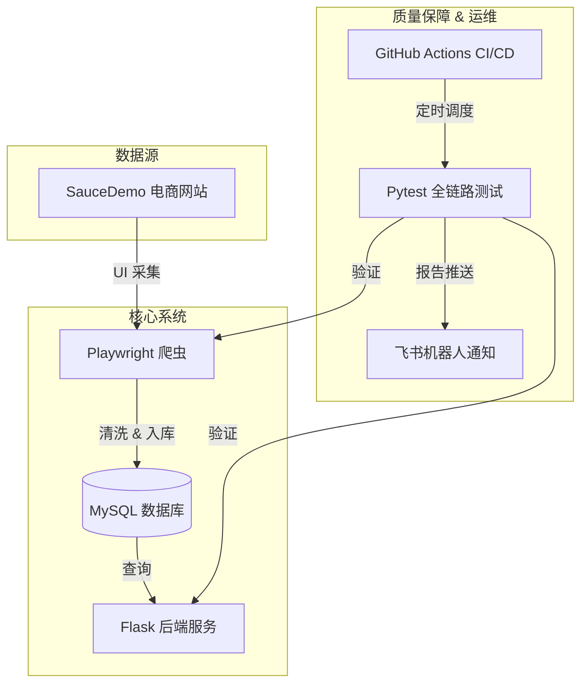

# 🛒 SauceMall-Monitor 全链路监控系统


**SauceMall-Monitor** 是一个全链路（End-to-End）数据监控与一致性验证系统。它模拟了真实业务场景中数据从"生产"到"消费"的完整生命周期，通过自动化手段保障数据的准确性与系统的稳定性。

---

## 🏗️ 系统架构 (Architecture)

系统采用 **Micro-Service** 风格的模块化设计，覆盖了从数据采集、清洗存储、API 服务到自动化验证的闭环。



## ✨ 核心特性 (Features)

*   **🕵️ 自动化采集 (Robost Scraper)**
    *   基于 **Playwright** 实现，无需手动配置 WebDriver。
    *   采用 **POM (Page Object Model)** 设计模式，业务逻辑与页面元素分离，易于维护。
    *   内置 **Loguru** 日志系统，实现 500MB 自动切割与 10 天保留策略。

*   **💾 高可靠存储 (Reliable Storage)**
    *   **事务管理**: 采用 `TRUNCATE` + `INSERT` 原子操作，确保数据一致性。
    *   **断连重试**: 数据库连接失败自动进行指数退避重试 (Retry Pattern)。
    *   **批量写入**: 使用 `executemany` 极速批量入库。

*   **🔌 RESTful API (Backend)**
    *   基于 **Flask** 构建的标准 API 服务。
    *   支持动态 SQL 查询 (`min_price`, `max_price`)。
    *   **虽然简单，但很安全**: 严格的 SQL 参数化查询，彻底杜绝注入风险。

*   **🛡️ 持续监控 (Continuous Monitoring)**
    *   **GitHub Actions**: 每日早上 8 点自动触发全链路测试。
    *   **Service Containers**: CI 环境自动编排 MySQL 容器。
    *   **IM 通知**: 测试报告自动推送到**飞书(Feishu)/钉钉**群。

## 🚀 快速开始 (Getting Started)

### 方式一：本地直接运行 (Development)

1.  **环境准备**
    *   Python 3.9+
    *   MySQL 5.7+ (本地需要起一个 MySQL 服务，或者修改 `db_manager.py` 配置)

2.  **安装依赖**
    ```bash
    pip install -r requirements.txt
    playwright install chromium
    ```

3.  **运行各模块**
    ```bash
    # 1. 运行爬虫 (抓取数据并存入库)
    python scraper.py
    
    # 2. 启动 API 服务
    python app.py
    ```

### 方式二：Docker Compose 一键启动 (Recommended)

如果你本地安装了 Docker，这是最省心的方式。

```bash
# 启动数据库
docker-compose up -d db

# 运行爬虫
python scraper.py

# 启动 API
python app.py
```

## ✅ 运行测试 (Testing)

项目集成了 **Pytest** + **Allure** 测试框架。

```bash
# 运行所有测试
pytest tests/

# 运行特定测试并生成报告
pytest tests/ --alluredir=allure-results
```

### 测试策略
*   `test_e2e.py`: **全链路测试**。验证 "抓取 -> 存库 -> API查询" 数据是否完全一致。
*   `test_api_advanced.py`: **API 专项测试**。数据驱动测试 (Data-Driven)，覆盖正常值、边界值和异常参数。

## 📂 项目结构

```text
SauceMall-Monitor/
├── .github/
│   └── workflows/ci.yml    # GitHub Actions 流水线定义
├── database/
│   └── db_manager.py       # 数据库连接、事务、CRUD 封装
├── pages/                  # Page Object Model (POM) 页面对象
│   ├── base_page.py
│   ├── login_page.py
│   └── inventory_page.py
├── tests/                  # 测试用例目录
│   ├── conftest.py         # Pytest Fixture (Setup/Teardown)
│   ├── test_e2e.py         # 全链路一致性测试
│   └── test_api_advanced.py
├── utils/
│   ├── logger.py           # Loguru 日志配置
│   └── notification.py     # 飞书/钉钉通知脚本
├── app.py                  # Flask 后端 API 服务
├── scraper.py              # 爬虫入口程序
├── docker-compose.yml      # 基础设施编排
└── requirements.txt        # 项目依赖
```

## 📜 许可证

MIT License.
